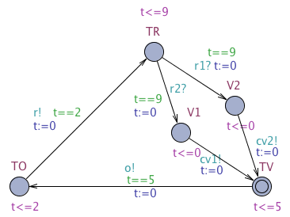
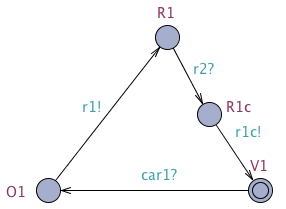
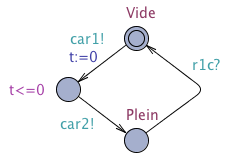
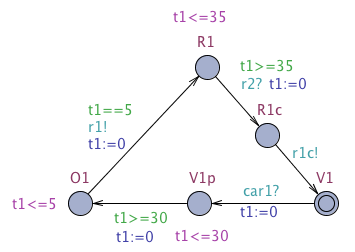
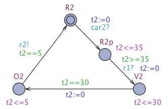

# Partie 1 - Deux feux synchronisés
Deux feux synchronisés mais non temporisés

## Questions 1 et 2
[Feux non synchronisés et non temporisés](https://github.com/masters-info-nantes/hong-cheng-lv/blob/master/ressources/part1/Q2-FeuxNonSynchro.xml)


## Question 3
[Feux synchronisés et non temporisés](https://github.com/masters-info-nantes/hong-cheng-lv/blob/master/ressources/part1/Q3-FeuxSynchro.xml)


## Question 4
[Graphe de marquage](https://github.com/masters-info-nantes/hong-cheng-lv/blob/master/ressources/part1/Q4-GrapheMarquage.txt)


## Question 5
Vérifications en LTL

## Question 6
**Vérifications**

- Pas de 2 feux rouges en même temps (sureté)

```
AG[0, inf](M(R1) + M(R2) >= 1)
```

- Un feu passe au moins une fois au vert (non bloqué)

```
AG[0, inf](M(V2) = 1)
```

- Les feux ne se bloquent pas entre eux

```
AG[0, inf](M(R1) + M(P7)) # P7 = place intermédiaire
```

# Partie 2 - Deux feux temporisés
## Question 7
[Feux temporisés sans synchronisation](https://github.com/masters-info-nantes/hong-cheng-lv/blob/master/ressources/part2/Q7-FeuxTemporises.xml)


**Validations**

- A n'importe quel moment il n'y a pas deux feux rouges en même temps

```
A[](feu1.R1 or feu2.R2 or feu1.I1 or feu2.I2)
```
- Pas de deadlock

```
E<> deadlock
```


## Question 8
[Un controleur temporisé est synchronisé avec les 2 feux pour changer leurs états](https://github.com/masters-info-nantes/hong-cheng-lv/blob/master/ressources/part2/Q8-ControleurTemporiseEtSynchro.xml)




**Validations**

- A n'importe quel moment il n'y a pas deux feux rouges en même temps

```
A[](feu1.R1 or feu2.R2)
```

- ?????????

```
E<>(feu1.R1 and feu2.O2)
```

- Pas de deadlock

```
E<> deadlock
```

# Partie 3 - Carrefour en T
## Question 9
[Sans contraintes de temps](https://github.com/masters-info-nantes/hong-cheng-lv/blob/master/ressources/part3/Q9-SansContraintesTemps.xml)

- 2 feux de la grande route considérés comme un seul
- Processus qui régule l'arrivée des voiture dans la petite rue





## Question 10
[Avec contraintes de temps](https://github.com/masters-info-nantes/hong-cheng-lv/blob/master/ressources/part3/Q10-AvecContraintesTemps.xml)

- Petite rue verte 30 secondes
- Dans un cycle, grande route verte au moins 30 secondes
- Delai de 1 seconde entre chaque changement de couleur
- Reste orange pendant 5 secondes





## Question 11

**Validations question 9**

- A n'importe quel moment il n'y a pas deux feux rouges en même temps

```
A[](Major.R1 or Minor.R2 or Minor.R2p)
```

- Pas de deadlock

```
E<> deadlock
```

**Validations question 10**

- A n'importe quel moment il n'y a pas deux feux rouges en même temps

```
A[](Major.R1 or Minor.R2 or Minor.R2p)
```

- Pas de deadlock

```
E<> deadlock
```